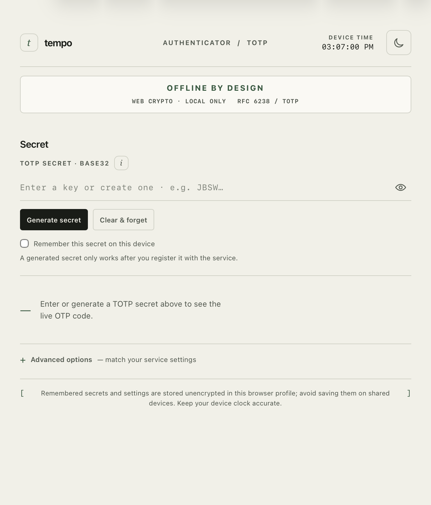
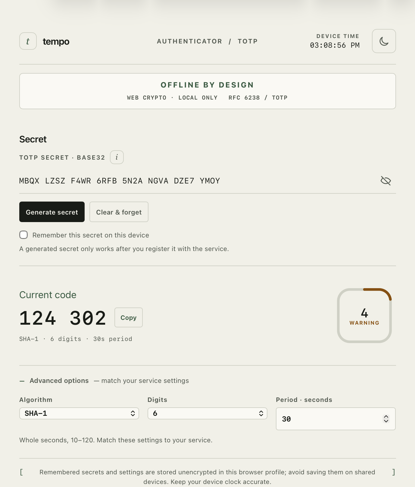

# Tempo
A small, standalone TOTP generator that runs entirely in the browser.

No backend, no accounts, no analytics, and no external resources. Enter a Base32 secret and the current OTP is generated locally using Web Crypto.

   

### Features
- RFC 6238 TOTP generation
- SHA-1, SHA-256, and SHA-512
- 6 or 8 digit codes
- Configurable 10 to 120 second period
- Random Base32 secret generation
- Copy-to-clipboard
- Light and dark mode
- Optional local storage for remembering a secret
- Single-file HTML app

### Privacy
The secret and generated codes stay in the browser. Tempo does not make network requests or send data anywhere.

If you enable "Remember this secret", the secret and settings are stored unencrypted in the browser's local storage. Don't use that option on a shared or untrusted device.

[Your device clock needs to be reasonably accurate for TOTP to work correctly.]

### Usage
Open tempo.html in a browser, or host it as a static HTML file.

For an existing account, enter the TOTP secret provided by the service. A generated secret is not registered anywhere, so it needs to be configured with the service before its codes can be used.

### License
Tempo is available for non-commercial use under the Non-Commercial Software License.

You can use, copy, modify, and redistribute it for non-commercial purposes. Commercial use requires permission from the copyright holder.
